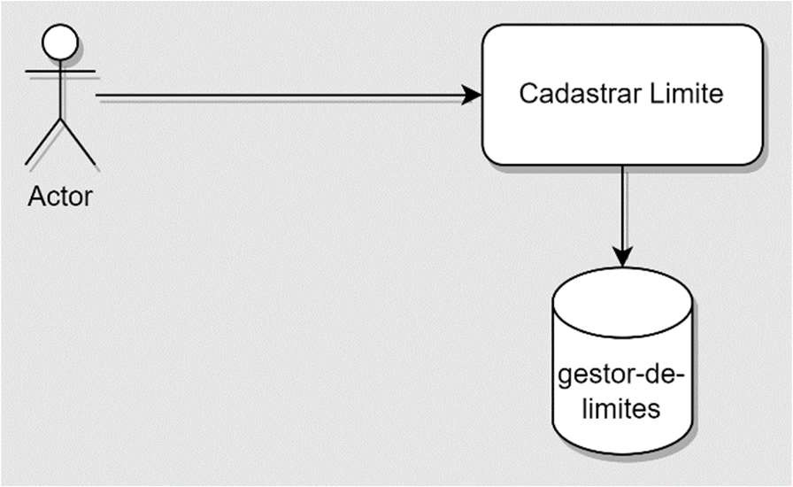
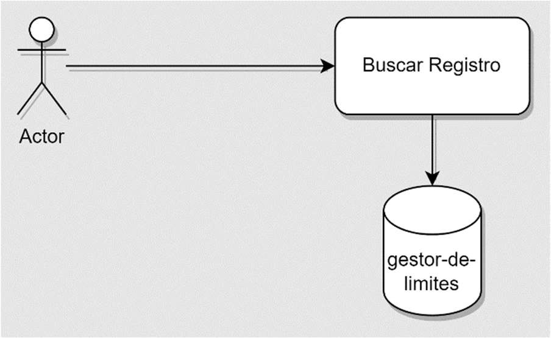
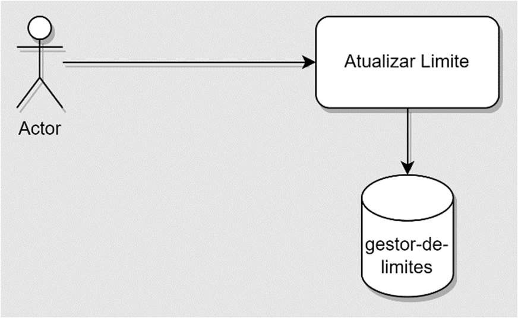
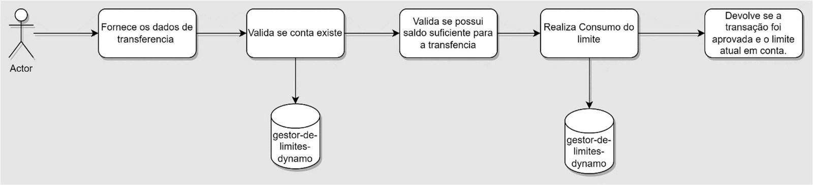
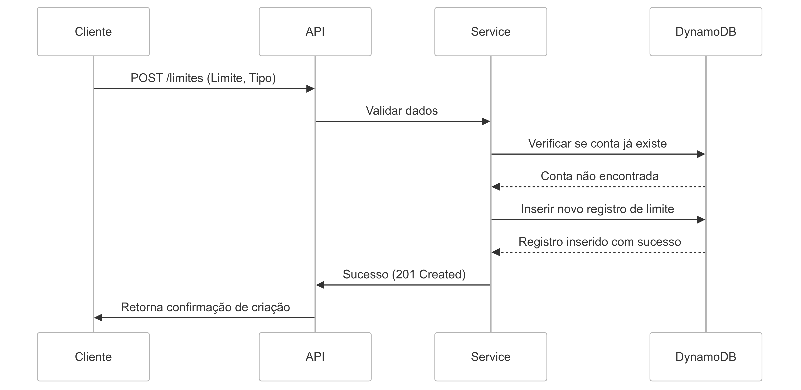
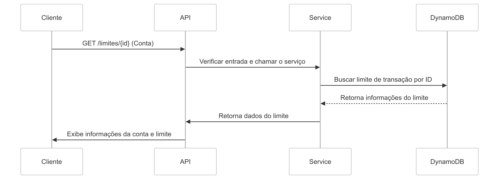
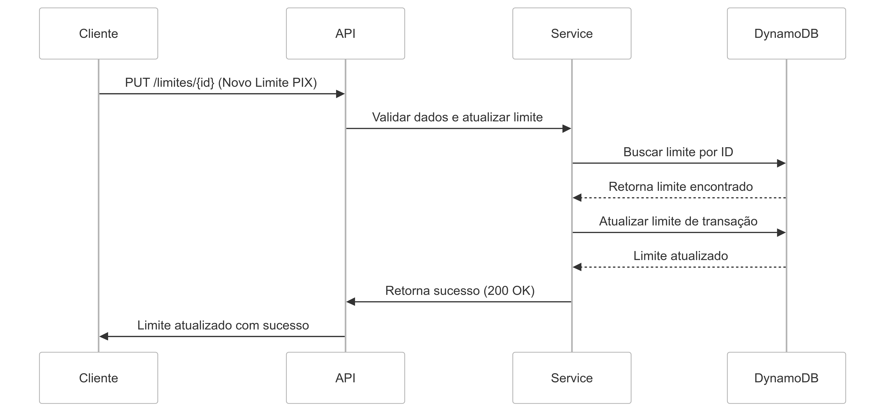
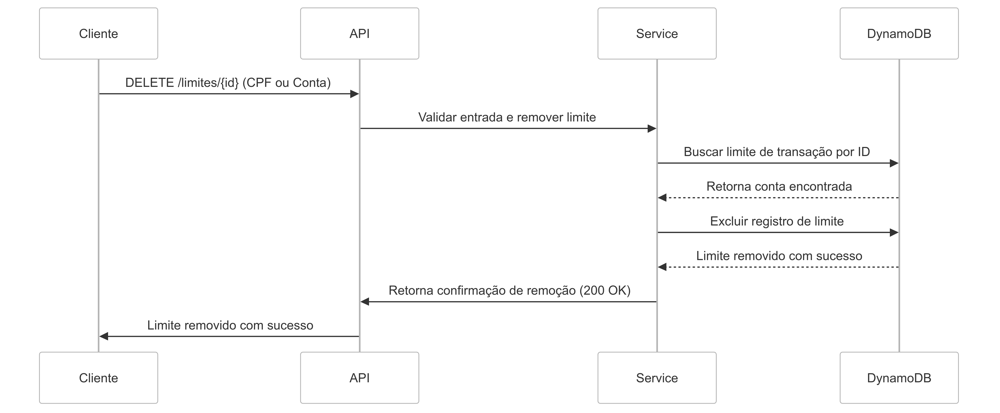
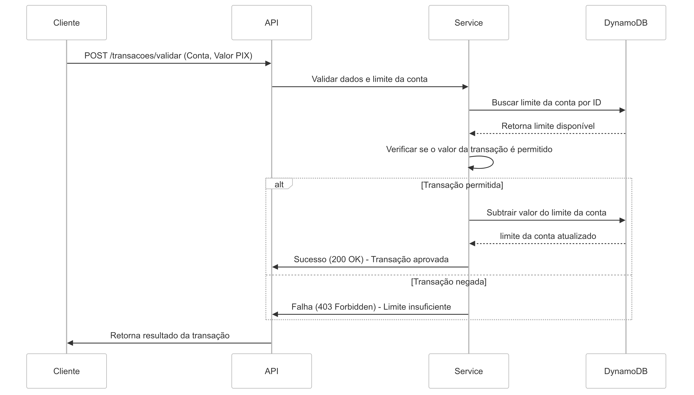

# KRT Limit Manager API ASP .NET Core 8.0 com C#

O banco KRT necessita de uma solução que permita o gerenciamento de limites das suas contas. Esse sistema deve ser capaz de avaliar o limite de uma conta e decidir se determinada transação pode ou não ser realizada. A princípio, essa solução atenderá apenas o modelo Pix.

## Dados de Negócio

1. O analista de fraudes do Banco KRT deve ser capaz de cadastrar no banco de dados as informações referentes à gestão de limite: documento, número da agência, número da conta e o limite para transações PIX:
   

2. O analista de fraudes do Banco KRT deve ser capaz de buscar as informações de limite para uma conta já cadastrada:
    

3. O analista de fraudes do Banco KRT deve ser capaz de alterar o limite para transações PIX de uma conta já cadastrada:
   

4. O analista de fraudes do Banco KRT deve ser capaz de remover um registro do banco de dados de limite:
   

5. As transações de PIX devem passar pelo sistema de gestão de limites, que irá conferir se o valor da transação está dentro do limite disponível para o cliente.

- Caso o limite seja menor que o valor transacionado, a transação precisa ser negada e não há consumo de limite.
- Caso o cliente possua limite para a transação, a mesma deve ser aprovada e o seu valor deve ser descontado do saldo da conta existente.
  

## Dados técnicos
### Diagramas de sequência de implementação das funcionalidades

#### Cadastro de nova conta

Apesar de esta entidade fugir do escopo da API, a ideia é que estas informações venham de outra fonte de dados. No entanto, para otimizar a utilização da API e facilitar para o utilizador, foi adicionado o endpoint de criação de conta bancária.

O cadastro de uma nova conta deverá usar a rota : ```POST /api/v1/account```


```json
{
    "branchCode": "String", // Deve possuir 4 caracteres e não deve ser nulo
    "accountNumber": "String", // Deve possuir 7 caracteres e não deve ser nulo
    "accountHolderName": "String", // Máximo 100 caracteres e não deve ser nulo
    "documentNumber": "String", // Validação de padrão CPF e não deve ser nulo
    "balance": "Decimal",
    "transactionLimits?": // Valor padrão null
    {
        "type": "Enum", // (Pix, TED, DOC) Valor padrão Pix, não permite novos types
        "value": "Decimal" // Valor padrão 0
    }
}
```

Contrado de saída
```json
{
    "accountId": "4210dd50-7326-41dd-bdca-11c1c92b186f",
    "branchCode": "1234",
    "accountNumber": "1234567",
    "accountHolderName": "Random Name",
    "documentNumber": "567.661.440-41",
    "createdAt": "12/10/2024 20:30:15", // (UTC -3) DD-MM-YYYY HH:mm:ss
    "balance": "20000.00",
    "transactionLimits?": // Valor padrão null, se informado este campo é obrigatório preencher corretamente
    {
        "type": "Pix", // valor padrão Pix
        "value": "1275.00",
        "createdAt": "12/10/2024 20:30:15"
    }
}
```

#### Busca de conta
A busca de informações de limite cadastrado deverá usar a rota ```GET /api/v1/account?{AccountId}```.

  
  
Contrado de saída
```json
{
    "accountId": "4210dd50-7326-41dd-bdca-11c1c92b186f",
    "branchCode": "1234",
    "accountNumber": "1234567",
    "accountHolderName": "Random Name",
    "documentNumber": "567.661.440-41",
    "createdAt": "12/10/2024 20:30:15", // (UTC -3) DD-MM-YYYY HH:mm:ss
    "balance": "20000.00",
    "transactionLimits?": // Valor padrão null, se informado este campo é obrigatório preencher corretamente
    {
        "type": "Pix", // valor padrão Pix
        "value": "1275.00",
        "createdAt": "12/10/2024 20:30:15"
    }
}
```

#### Cadastro de limite

O cadastro de um novo limite deverá usar a rota ```POST /api/v1/limit```.



Contrato de entrada
```json
{
    "transactionLimits":
    {
        "type": "Pix",
        "value": "Decimal" //Valor padrão 0
    }
}
```

Contrado de saída
```json
{
    "transactionLimits":
    {
        "type": "Pix",
        "value": "1250.00",
        "createdAt": "12/10/2024 20:30:15"
    }
}
```

#### Busca de informações de limite
A busca de informações de limite cadastrado deverá usar a rota ```GET /api/v1/limit?{AccountId}```.

  
  
Contrado de saída
```json
{
    "transactionLimits":
    {
        "type": "Pix",
        "value": "1250.00",
        "createdAt": "12/10/2024 20:30:15",
        "updatedAt?": "12/10/2024 20:30:15"
    }
}
```

#### Alterar limite
A busca de informações de limite cadastrado deverá usar a rota ```PUT /api/v1/limit?{AccountId}```

  
  
Contrato de entrada
  
```json
{
    "transactionLimits":
    {
        "type": "Pix",
        "value": "Decimal" //Valor padrão 0
    }
}
```

Contrado de saída
```json
{
    "transactionLimits":
    {
        "type": "Pix",
        "value": "1250.00",
        "createdAt": "12/10/202420:30:15",
        "updatedAt?": "12/10/202422:55:08",
    }
}
```

#### Deletar limite

A remoção de limite cadastrado deverá usar a rota ```DELETE /api/v1/limit?{AccountId}```

  

#### Validação de transação pix
A validação de transação pix deverá usar a rota ```POST /api/v1/transaction/validate```

  

Contrato de entrada
```json
{
    "accountId": "Guid",
    "type" : "Pix",
    "value": "Decimal",
    "pixKey": "String",
    "transactionDate": "Date time"
}
```

#### Tecnologias
- [.NET 8;](https://dotnet.microsoft.com/pt-br/download/dotnet/8.0)
- [Swashbuckle.AspNetCore](https://learn.microsoft.com/pt-br/aspnet/core/tutorials/getting-started-with-swashbuckle?view=aspnetcore-8.0&tabs=visual-studio)
- [Xunit](https://xunit.net/docs/getting-started/v3/cmdline);
- [Dynamo AWS](https://aws.amazon.com/pt/pm/dynamodb/?gclid=CjwKCAjw3624BhBAEiwAkxgTOoKZFNK7Ujutjh1L1HgQNuScmZNU-8XNcb8I6C7_09fTZR0wS4MwtBoCxfoQAvD_BwE&trk=3e4c2258-4f21-4854-9de7-2f6da2ef0989&sc_channel=ps&ef_id=CjwKCAjw3624BhBAEiwAkxgTOoKZFNK7Ujutjh1L1HgQNuScmZNU-8XNcb8I6C7_09fTZR0wS4MwtBoCxfoQAvD_BwE:G:s&s_kwcid=AL!4422!3!589951433441!e!!g!!aws%20dynamodb!16393976581!133547551333);
- [Arquitetura MVC](https://learn.microsoft.com/en-us/aspnet/mvc/overview/older-versions-1/getting-started-with-mvc/);

#### Boas Práticas
- [Clean Code](https://balta.io/artigos/clean-code);
- [SOLID](https://www.c-sharpcorner.com/UploadFile/damubetha/solid-principles-in-C-Sharp/);
- [DDD Domain Driven Design](https://learn.microsoft.com/pt-br/dotnet/architecture/microservices/microservice-ddd-cqrs-patterns/ddd-oriented-microservice)
- [GIT Flow](https://learn.microsoft.com/pt-br/azure/devops/repos/git/git-branching-guidance?view=azure-devops)


### Autor
[@ChristianLourenço](https://www.linkedin.com/in/christian-louren%C3%A7o-53319915b/)
